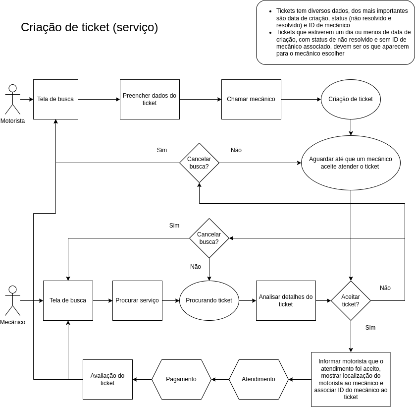

# mechanize-api
Mechanize (API) assist people fix their car and reach their destination.

## We use:

## Requirement
Download [PostgreSQL](https://www.postgresql.org) to use databases.

## Architecture 
- The helpers, services, controllers, repositories, enums and others files should have a **suffix** in name, example: `users_controller.py`;
- Repositories and enums should be named in **singular**, example: `user_repository.py`;
- Files should be in _snake_case_ and class name in _PascalCase_;
- Microservices should be in **plural** name;
- Use `psql -h YOUR_HOST -d YOUR_DATABASE_NAME -U YOUR_USER -p YOUR_PORT` to connect in database;
- Set a script in database needs to run `\i script.sql`.

## Microservices:
- [Accounts](https://github.com/tech-warriors-corporation/mechanize-accounts-api);
- [Helps](https://github.com/tech-warriors-corporation/mechanize-helps-api).

## Roadmap:
- [ ] Review all topics;
- [X] Read about [blueprints](https://flask.palletsprojects.com/en/2.2.x/blueprints) to apply in routes;
- [X] Use [Stock Management (API)](https://github.com/tech-warriors-corporation/stock-management-api) as example (remove it in future);
- [X] Block commits in main branch;
- [X] Add [CORS](https://flask-cors.readthedocs.io/en/latest) to correct origin (use CLIENT_ID as solution);
- [X] Create events to communicate microservices;
- [X] Verify if controller throw when repository or service throws;
- [X] Get user tokenized from JWT ([PyJWT](https://pyjwt.readthedocs.io/en/stable));
- [X] Read about [add_url_rule](https://tedboy.github.io/flask/generated/generated/flask.Flask.add_url_rule.html);
- [X] See this [Saga architecture pattern](https://github.com/victoramsantos/saga-pattern-example) example;
- [X] Create base classes for services, repositories, controllers and others;
- [X] Connect to development and production databases;
- [X] Set environment variables and remove hardcoded properties;
- [ ] Create more functions to product;
- [ ] Improve product always;
- [X] Cancel ticket from driver and mechanic in attending ticket;
- [X] The mechanic can't create a help (necessary block request);
- [ ] Payment gateway integration;
- [X] Set HTTPS (version 2);
- [X] Pay for [Render](http://render.com) simple plan;
- [ ] QA environment;
- [ ] Implement 2FA;
- [ ] Block IP if user tries a lot of requests in the same endpoint;
- [ ] Use [WebSocket](https://websockets.readthedocs.io/en/stable);
- [X] Can not select a ticket that is cancelled or other wrong thing;
- [X] Configure servers for microservices (urls, environment variables and others);
- [X] Create our PostgreSQL databases in [Render](http://render.com);
- [ ] Get available tickets close from mechanic who is call services;
- [ ] Paginate some requests;
- [X] Verify if user who is calling endpoint is the user of ticket;
- [ ] Update manual of app;
- [X] Set URL of API's in GitHub repositories;
- [x] Validate access token in headers request;
- [X] Study about **Decompose by Subdomain**, **API Composition**, **API Gateway** and **Healthcheck**;
- [X] Remove _FOREIGN KEY_ at databases;
- [X] Presentation in this [link](https://docs.google.com/presentation/d/1Lg9F8AQ7EC_kl3MGeP_LC1doj6Vgae6Oy9oliftIX6Y/edit#slide=id.g1dfaed90b67_2_61);
- [X] Layout in [Figma](https://www.figma.com/file/kl05E88sullmKzVTNxXItO/Mechanize?node-id=0-1&t=eUnJ6JgzMokk1muF-0);
- [X] Check all repositories and documentations;
- [X] Do get of user from id in [Accounts](https://github.com/tech-warriors-corporation/mechanize-accounts-api) microservice;
- [X] Make service create in [Helps](https://github.com/tech-warriors-corporation/mechanize-helps-api) microservice;
- [X] Return user id after create it in [Accounts](https://github.com/tech-warriors-corporation/mechanize-accounts-api) microservice.

## Create ticket diagram (pt-BR):

